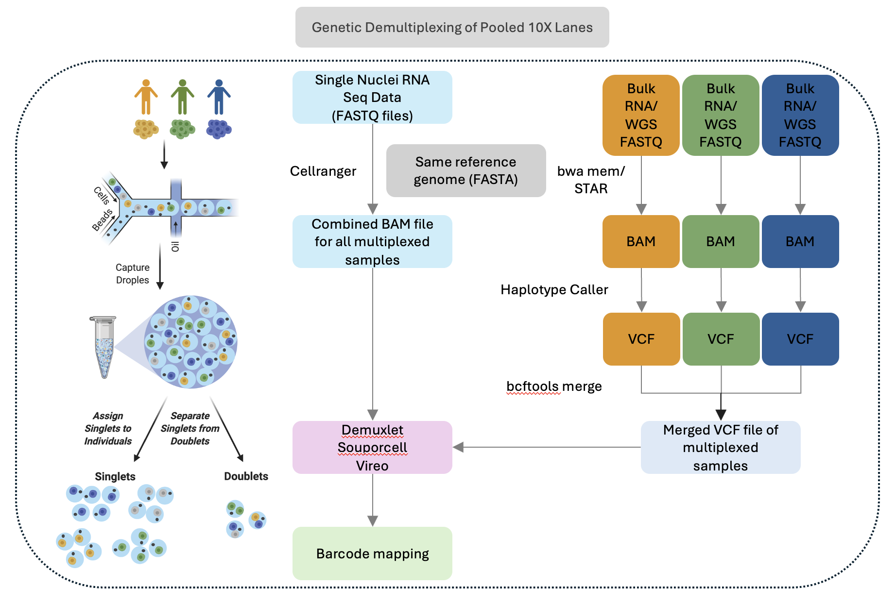

# ngs-demux-pipeline

A cloud-native Nextflow DSL2 pipeline for **genetic demultiplexing of pooled single-nuclei RNA-seq data**, using bulk RNA-seq for genotype calling.

---

## Overview



## Architecture

| Layer | Technology |
|---|---|
| Orchestration | Nextflow DSL2 |
| Cloud compute | AWS Batch |
| Storage | Amazon S3 |
| Containers | Docker |
| Monitoring | Seqera Platform |
| Event trigger | S3 + Lambda → Seqera API *(planned)* |

## Pipeline Phases

| Phase | Subworkflow | Status |
|---|---|---|
| A | Reference staging to S3 + Docker images | ✅ Complete |
| B | GENOTYPE_CALLING (STAR → GATK → bcftools) | ✅ Complete |
| C | SINGLECELL_PREP (Cell Ranger) | ⬜ Planned |
| D | DEMULTIPLEXING (Demuxlet + Vireo + Souporcell) | ⬜ Planned |
| E | End-to-end integration + event-driven trigger | ⬜ Planned |

## Samplesheet Format

```csv
sample_id,fastq_dir,data_type,expected_cells
sample1,s3://bucket/inputs/bulk_rna/sample1/,bulk_rna,
sample2,s3://bucket/inputs/bulk_rna/sample2/,bulk_rna,
pooled_liver,s3://bucket/inputs/singlecell/pooled_liver/,singlecell,8000
```

- `bulk_rna` rows → `GENOTYPE_CALLING` (runs in parallel across all samples)
- `singlecell` rows → `SINGLECELL_PREP`
- Number of donors inferred from number of `bulk_rna` rows

## Quick Start

```bash
nextflow run main.nf \
    --samplesheet  assets/samplesheet.csv \
    --star_index   s3://nextflow-scrna-abhishek/ngs-demux/reference/star_index_2.7.11b/ \
    --genome_fasta s3://nextflow-scrna-abhishek/ngs-demux/reference/refdata-gex-GRCh38-2020-A/fasta/genome.fa \
    --ref_dir      s3://nextflow-scrna-abhishek/ngs-demux/reference/refdata-gex-GRCh38-2020-A/ \
    --outdir       s3://nextflow-scrna-abhishek/ngs-demux/outputs/run_001 \
    -profile batch,tower \
    -w s3://nextflow-scrna-abhishek/ngs-demux/work
```

## Container Images

| Process | Image | Registry |
|---|---|---|
| STAR 2.7.11b, GATK 4.6.2.0, samtools 1.21, bcftools, AWS CLI v2 | `murtiabhishek/star-gatk:1.4.0` | Docker Hub |
| Cell Ranger | `cellranger:7.2.0` | Private ECR only |
| Demuxafy (Demuxlet, Vireo, Souporcell) | `demuxafy:3.0.0` | Private ECR only |

See `docker/cellranger/README.md` and `docker/demuxafy/README.md` for build instructions.

## Reference Data

Uses the 10x Genomics GRCh38-2020-A reference (Ensembl 98 / GENCODE v32), staged to S3:

```
s3://nextflow-scrna-abhishek/ngs-demux/reference/
├── refdata-gex-GRCh38-2020-A/
│   ├── fasta/
│   │   ├── genome.fa        # used by GATK HaplotypeCaller
│   │   ├── genome.fa.fai    # pre-built FASTA index
│   │   └── genome.dict      # pre-built sequence dictionary
│   ├── genes/
│   │   └── genes.gtf
│   └── star/                # Cell Ranger pre-built index (used by Cell Ranger only)
└── star_index_2.7.11b/      # custom STAR index built with STAR 2.7.11b on Wynton
                             # used by STAR_ALIGN for bulk RNA-seq
```

> **Note on STAR index compatibility:** The Cell Ranger pre-built `star/` index is incompatible
> with standalone STAR due to internal version differences. A custom index was built with
> STAR 2.7.11b using the same FASTA and GTF, ensuring consistency across both alignment arms.

## S3 Layout

```
s3://nextflow-scrna-abhishek/ngs-demux/
├── reference/
├── inputs/
│   ├── bulk_rna/
│   │   ├── sample1/
│   │   ├── sample2/
│   │   ├── sample3/
│   │   └── sample4/
│   └── singlecell/
│       └── pooled_liver/
├── work/                    # Nextflow work directory
└── outputs/
    └── {run_id}/
```

## HPC vs Cloud

| Aspect | UCSF HPC (SGE) | This pipeline (AWS Batch) |
|---|---|---|
| Job scheduling | `#$ -t 1-N` array jobs | Nextflow channels — automatic parallelism |
| Containers | Singularity modules | Docker |
| Storage | `/wynton/scratch` | S3 |
| Monitoring | qstat / log files | Seqera Platform |
| Scalability | Fixed cluster | On-demand |

## References

- [Demuxafy documentation](https://demultiplexing-doublet-detecting-docs.readthedocs.io)
- [Nextflow DSL2](https://nextflow.io/docs/latest/)
- [GATK RNA-seq variant calling best practices](https://gatk.broadinstitute.org/hc/en-us/articles/360035531192)
- [10x Genomics GRCh38-2020-A reference](https://www.10xgenomics.com/support/software/cell-ranger/downloads)
- [Seqera Platform](https://seqera.io)